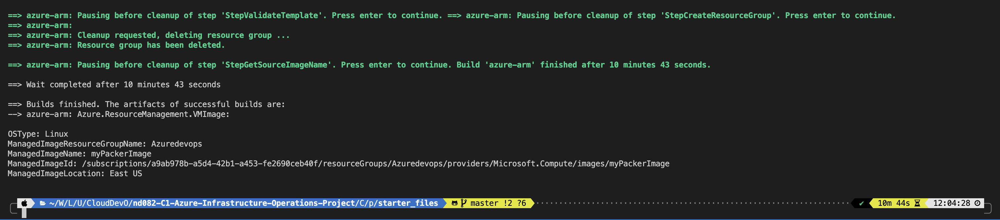
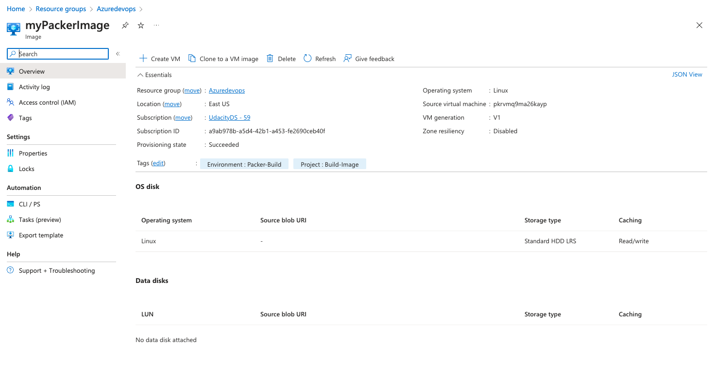
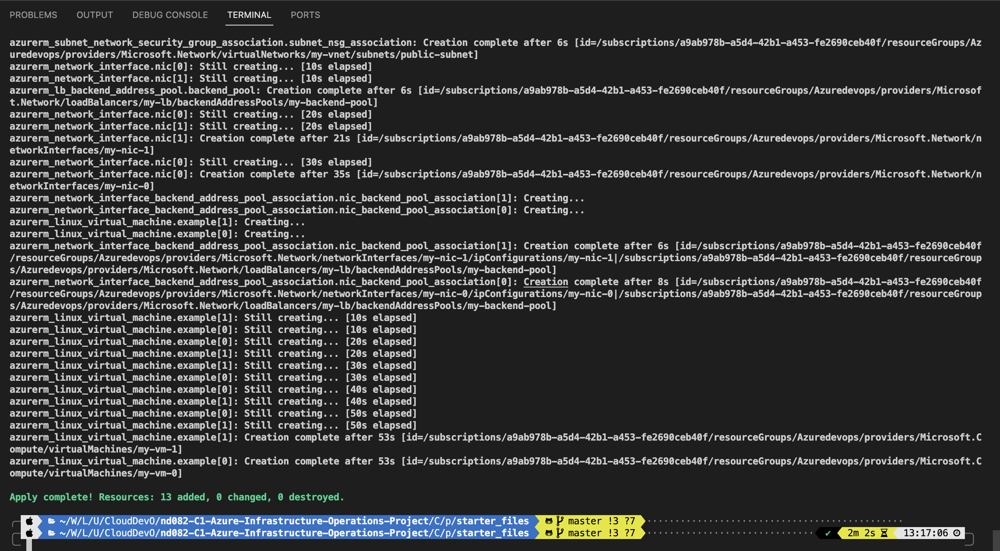
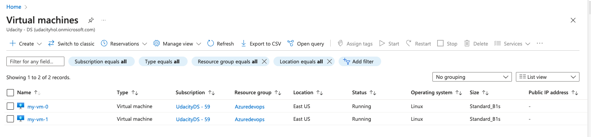
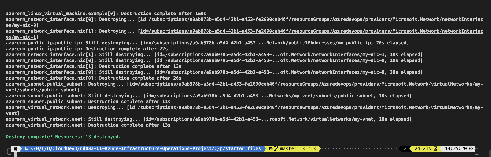
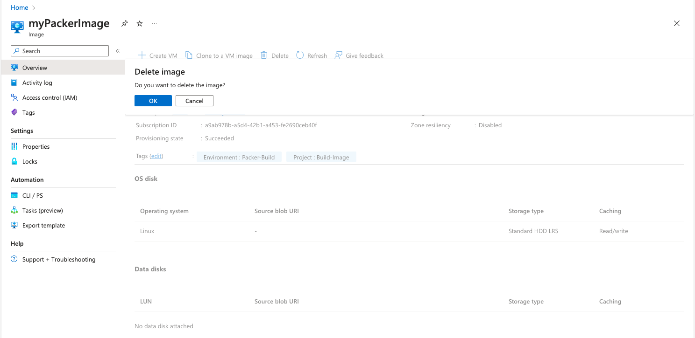

# Azure Infrastructure Operations Project: Deploying a scalable IaaS web server in Azure

### Introduction
For this project, you will write a Packer template and a Terraform template to deploy a customizable, scalable web server in Azure.

### Getting Started
1. Clone this repository
2. Install all dependencies below
3. Login to Azure Portal via AZ CLI
4. Create Packer image
5. Deploy Infrastructure via Terraform

### Dependencies
1. Create an [Azure Account](https://portal.azure.com) 
2. Install the [Azure command line interface](https://docs.microsoft.com/en-us/cli/azure/install-azure-cli?view=azure-cli-latest)
3. Install [Packer](https://www.packer.io/downloads)
4. Install [Terraform](https://www.terraform.io/downloads.html)

### Instructions
1. Login Azure Portal via AZ CLI

- You should you Credential from Udacity Cloud Lab to login Azure Portal first. After that, create these env variable:
```bash
export ARM_CLIENT_ID=""
export ARM_CLIENT_SECRET=""
export ARM_SUBSCRIPTION_ID=""
export ARM_TENANT_ID=""
```

2. Create Packer image:
```bash
cd ./C1\ -\ Azure\ Infrastructure\ Operations/project/starter_files
packer plugins install github.com/hashicorp/azure
packer build server.json 
```
Output:



3. Deploy Infrastructure via Terraform

Chose VM number in terraform.tfvars, example 2 vms.
```bash
cd ./C1\ -\ Azure\ Infrastructure\ Operations/project/starter_files
terraform init
terraform plan -out solution.plan
terraform apply solution.plan --auto-approve
```
Output:



4. Destroy Infrastructure via Terraform
```bash
cd ./C1\ -\ Azure\ Infrastructure\ Operations/project/starter_files
terraform destroy --auto-approve
```
Output:


5. Remove Packer image on Azure Portal


### Output
Main output is step 3:


